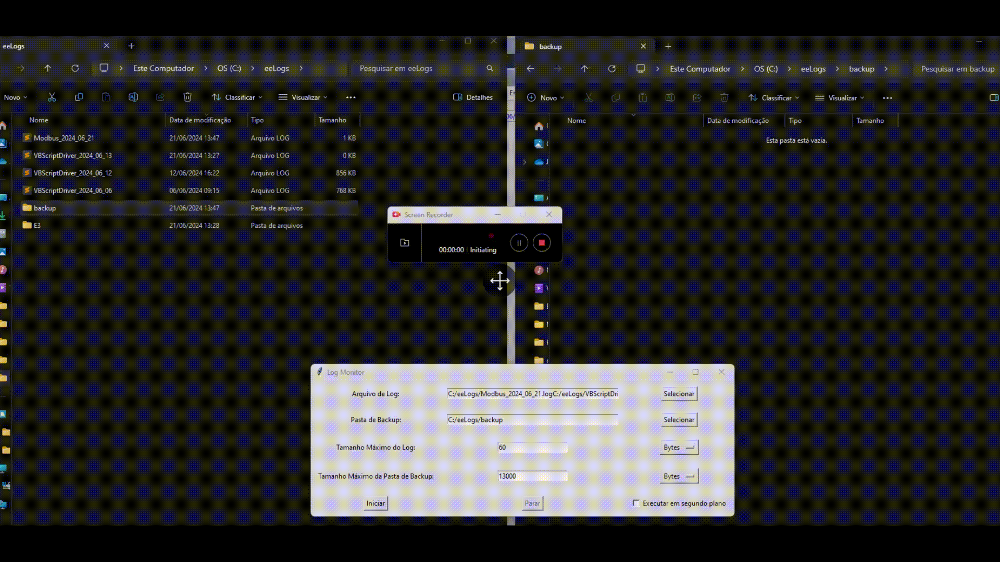

# Log Monitor App

## Descrição

O **Log Monitor App** é uma aplicação GUI para monitorar arquivos de log. Ele permite que você defina um tamanho máximo para o arquivo de log, e quando esse tamanho for atingido, o arquivo é compactado (zipado) e salvo em um diretório de backup. Além disso, é possível definir um tamanho máximo para a pasta de backup, e o programa excluirá os arquivos mais antigos para manter o tamanho dentro do limite especificado.

## Funcionalidades

- **Monitoramento de Arquivo de Log**: Monitora um arquivo de log especificado e realiza a compressão quando o tamanho máximo é atingido.
- **Compressão de Logs**: Compacta os arquivos de log em um arquivo zip com um sufixo de data.
- **Gerenciamento da Pasta de Backup**: Mantém a pasta de backup dentro do tamanho máximo especificado, excluindo os arquivos mais antigos conforme necessário.
- **Unidades de Medida**: Permite definir tamanhos em Bytes, Megabytes ou Gigabytes.
- **Modo de Segundo Plano**: Opção para executar o monitoramento em segundo plano.

## Requisitos

- Python 3.x
- Tkinter (biblioteca padrão do Python para GUI)

## Instalação

1. Certifique-se de ter o Python 3.x instalado em seu sistema.
2. Clone este repositório ou baixe o arquivo `log_monitor_app_atualizado.py`.

```sh
git clone https://github.com/seu_usuario/seu_repositorio.git
```

3. Navegue até o diretório onde o arquivo `log_monitor_app_atualizado.py` está localizado.

```sh
cd caminho/para/seu_repositorio
```

4. Execute o script.

```sh
python log_monitor_app_atualizado.py
```

## Uso

1. Abra o aplicativo.
2. Use o botão "Selecionar" para escolher o arquivo de log a ser monitorado.
3. Use o botão "Selecionar" para escolher a pasta onde os arquivos zip de backup serão salvos.
4. Insira o tamanho máximo permitido para o arquivo de log e selecione a unidade (Bytes, Megabytes, Gigabytes).
5. Insira o tamanho máximo permitido para a pasta de backup e selecione a unidade.
6. Se desejar, marque a opção "Executar em segundo plano".
7. Clique no botão "Iniciar" para começar o monitoramento.
8. Clique no botão "Parar" para interromper o monitoramento.

## Interface do Usuário

- **Arquivo de Log**: Caminho para o arquivo de log que será monitorado.
- **Pasta de Backup**: Caminho para a pasta onde os arquivos de backup zipados serão salvos.
- **Tamanho Máximo do Log**: Valor numérico e unidade para o tamanho máximo do arquivo de log.
- **Tamanho Máximo da Pasta de Backup**: Valor numérico e unidade para o tamanho máximo da pasta de backup.
- **Executar em Segundo Plano**: Checkbox para executar o monitoramento em segundo plano.
- **Iniciar**: Botão para iniciar o monitoramento.
- **Parar**: Botão para parar o monitoramento.

## Estrutura do Código

- `__init__`: Inicializa a interface gráfica e define os elementos da GUI.
- `select_log_file`: Abre um diálogo de arquivo para selecionar o arquivo de log.
- `select_backup_dir`: Abre um diálogo de diretório para selecionar a pasta de backup.
- `convert_size_to_bytes`: Converte o tamanho especificado para bytes com base na unidade.
- `start_monitoring`: Inicia o monitoramento do arquivo de log.
- `stop_monitoring`: Para o monitoramento do arquivo de log.
- `monitor_log_file`: Monitora o arquivo de log e realiza a compressão quando o tamanho máximo é atingido.
- `zip_and_clear_log`: Compacta o arquivo de log e limpa o conteúdo original.
- `manage_backup_dir_size`: Gerencia o tamanho da pasta de backup, excluindo arquivos antigos conforme necessário.



## Contribuição

Contribuições são bem-vindas! Sinta-se à vontade para abrir um issue ou enviar um pull request.

## Licença

Este projeto está licenciado sob a licença MIT. Veja o arquivo [LICENSE](LICENSE) para mais detalhes.
